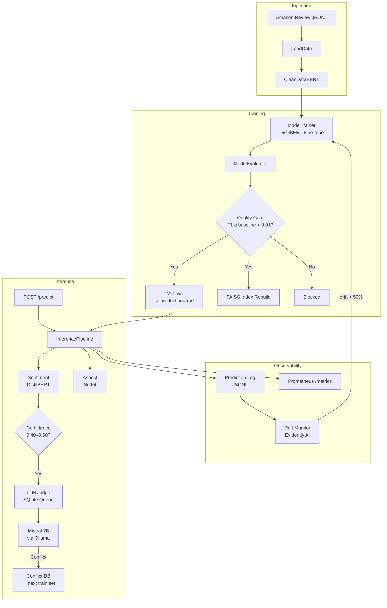

# ReviewSentinel

> A production-grade MLOps pipeline for fine-tuning and serving DistilBERT-based sentiment analysis on customer reviews. Built to demonstrate end-to-end engineering maturity: data validation, model training, quality-gated deployment, drift monitoring, explainability, and semantic search — all orchestrated and observable.

[](https://github.com/BUZEL-112/ReviewSentinel/actions)
[](https://www.python.org/)
[](LICENSE)

---

## What This System Does

ReviewSentinel classifies customer reviews as **negative**, **neutral**, or **positive** using a fine-tuned DistilBERT model. Beyond a simple classifier, it is a full MLOps system:

- **Prediction API** — FastAPI endpoint with confidence scores, SHAP explanations, and semantic similarity enrichment
- **Quality-gated training** — new models only deploy if they beat the current production F1 by a configurable margin
- **Automated drift monitoring** — weekly Evidently AI reports on incoming prediction distributions; auto-retraining above configurable thresholds
- **LLM Judge** — uncertain predictions (confidence 0.40–0.60) are queued for a Mistral 7B second opinion via Ollama; conflicts feed back into the training set
- **Semantic search** — FAISS flat-index retrieval of historically similar reviews with a sentiment alignment signal

---

## Architecture



---

## Quick Start

**Prerequisites:** Docker, Docker Compose. See [Getting Started](docs/guides/getting-started.md) for full requirements.

```bash
# 1. Clone
git clone https://github.com/BUZEL-112/ReviewSentinel.git
cd ReviewSentinel

# 2. Configure environment
cp .env.example .env          # edit with your credentials

# 3. Start the full stack
docker-compose -f docker/docker-compose.yaml up --build -d

# 4. Verify the API is healthy
curl http://localhost:8000/health

# 5. Make a prediction
curl -X POST http://localhost:8000/predict \
  -H "Content-Type: application/json" \
  -d '{"title": "Broke after one week", "text": "Complete waste of money."}'
```
curl http://localhost:30080/api/health
---

## Service URLs (Docker Compose)

| Service | URL | Description |
|---------|-----|-------------|
| **API** | `http://localhost:8000` | FastAPI prediction endpoint |
| **API Docs** | `http://localhost:8000/docs` | Interactive Swagger UI |
| **MLflow** | `http://localhost:5000` | Experiment tracking |
| **Prefect** | `http://localhost:4200` | Pipeline orchestration |
| **MinIO** | `http://localhost:9001` | Artifact storage console |

---

## Documentation

| Document | Audience | Description |
|----------|----------|-------------|
| [Getting Started](docs/guides/getting-started.md) | New developer | Prerequisites, local setup, zero-to-API in < 1 hour |
| [Local Docker Guide](docs/guides/local-docker.md) | Developer | Full Docker Compose usage, service URLs, teardown |
| [Contributing](docs/guides/contributing.md) | Contributor | Branching, PR process, code style |
| [Architecture Overview](docs/architecture/overview.md) | All | System components, training path, inference path |
| [Data Flow](docs/architecture/data-flow.md) | ML Engineer | Life of a review from raw JSONL to prediction log |
| [Component Diagram](docs/architecture/component-diagram.md) | Infra Engineer | Docker vs. Kubernetes topology |
| [API Reference](docs/api/reference.md) | API Consumer | Every endpoint, field semantics, error codes, examples |
| [Error Codes](docs/api/error-codes.md) | API Consumer | All non-200 responses and client handling |
| [Authentication](docs/api/authentication.md) | API Consumer | Current auth posture and production recommendations |
| [Model Card](docs/ml/model-card.md) | ML Engineer / Evaluator | Model intended use, performance, failure modes |
| [Data Card](docs/ml/data-card.md) | ML Engineer | Dataset source, splits, label distribution |
| [Training Guide](docs/ml/training-guide.md) | ML Engineer | How to retrain, quality gate, common pitfalls |
| [Experiment Tracking](docs/ml/experiment-tracking.md) | ML Engineer | MLflow workflow, artifact structure |
| [Deploying to Kind](docs/operations/deploying-to-kind.md) | Infra Engineer | Kind cluster provisioning runbook |
| [Secrets Reference](docs/operations/secrets.md) | Infra Engineer | All secrets: source, rotation, verification |
| [Runbooks](docs/operations/runbooks.md) | Infra Engineer | Operational procedures: rotate, rollback, scale |
| [Troubleshooting](docs/operations/troubleshooting.md) | Developer / Infra | Known issues, startup race conditions, import errors |
| [ADR 001 — DistilBERT](docs/decisions/001-distilbert-over-larger-models.md) | Evaluator | Why DistilBERT over larger alternatives |
| [ADR 002 — Prefect](docs/decisions/002-prefect-over-alternatives.md) | Evaluator | Why Prefect over Airflow / Celery |
| [ADR 003 — SQLite Queue](docs/decisions/003-sqlite-for-llm-judge-queue.md) | Evaluator | Why SQLite for the LLM Judge queue |
| [ADR 004 — FAISS Flat](docs/decisions/004-faiss-flat-index-over-hnsw.md) | Evaluator | Why exact search over approximate |
| [ADR 005 — MinIO](docs/decisions/005-minio-over-s3.md) | Evaluator | Why MinIO over real AWS S3 |
| [ADR 006 — Kind](docs/decisions/006-kind-for-local-k8s.md) | Evaluator | Why Kind for local Kubernetes |
| [ADR 007 — Prompt Parsing](docs/decisions/007-three-tier-prompt-parsing.md) | Evaluator | Why three-tier fallback for LLM output |
